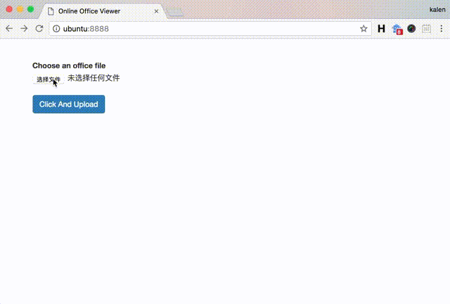

# 在线预览office
preview doc/ppt/xls online via unoconv.

## 结果


## 安装
``` sh
sudo yum install unoconv redis-server php5-redis
先安装 LibreOffice,再安装 unoconv ，然后安装 redis , 最后进入documentPreview目录安装依赖。
```

## 开发
每次启动项目，按照下面1 和 2 启动服务，若redis已启动，启动worker即可。
### 1. 启动 Redis server
``` sh
redis-server
```

### 2. 启动 Convert-Worker
``` sh
cd online_office_viewer/cli
bash ./start_worker.sh
```

## powerd by
gaoliang